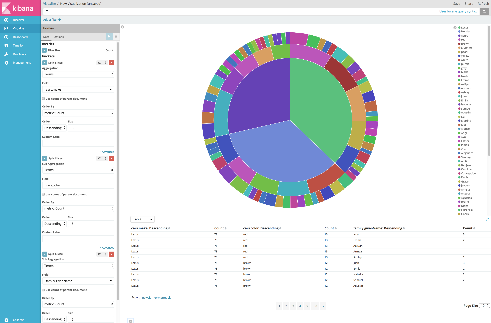

***Latest KNQL Plugin Releases***

|Kibana Release|Plugin Version Link|
|-------|-------|
|6.2.4|[6.2.4-1.0.1](https://github.com/ppadovani/KibanaNestedSupportPlugin/releases/download/6.2.4-1.0.1/nested-fields-support-6.2.4-1.0.1.zip)|
|6.2.3|[6.2.3-1.0.1](https://github.com/ppadovani/KibanaNestedSupportPlugin/releases/download/6.2.3-1.0.1/nested-fields-support-6.2.3-1.0.1.zip)|
|6.2.2|[6.2.2-1.0.6](https://github.com/ppadovani/KibanaNestedSupportPlugin/releases/download/6.2.2-1.0.6/nested-fields-support-6.2.2-1.0.6.zip)|
|6.2.1|[6.2.1-1.0.8](https://github.com/ppadovani/KibanaNestedSupportPlugin/releases/download/6.2.1-1.0.8/nested-fields-support-6.2.1-1.0.8.zip)|
|6.1.3|[6.1.3-1.0.4](https://github.com/ppadovani/KibanaNestedSupportPlugin/releases/download/6.1.3-1.0.4/nested-fields-support-6.1.3-1.0.4.zip)|
|6.1.2|[6.1.2-1.0.4](https://github.com/ppadovani/KibanaNestedSupportPlugin/releases/download/6.1.2-1.0.4/nested-fields-support-6.1.2-1.0.4.zip)|
|6.1.1|[6.1.1-1.0.2](https://github.com/ppadovani/KibanaNestedSupportPlugin/releases/download/6.1.1-1.0.2/nested-fields-support-6.1.1-1.0.2.zip)|
|6.0.1|[6.0.1-1.1.2](https://github.com/ppadovani/KibanaNestedSupportPlugin/releases/download/6.0.1-1.1.2/nested-fields-support-6.0.1-1.1.2.zip)|
|5.6.9|[5.6.9-1.0.0](https://github.com/ppadovani/KibanaNestedSupportPlugin/releases/download/5.6.9-1.0.0/nested-fields-support-5.6.9-1.0.0.zip)|
|5.6.8|[5.6.8-1.0.0](https://github.com/ppadovani/KibanaNestedSupportPlugin/releases/download/5.6.8-1.0.0/nested-fields-support-5.6.8-1.0.0.zip)|
|5.6.7|[5.6.7-1.0.1](https://github.com/ppadovani/KibanaNestedSupportPlugin/releases/download/5.6.7-1.0.1/nested-fields-support-5.6.7-1.0.1.zip)|
|5.6.6|[5.6.6-1.0.3](https://github.com/ppadovani/KibanaNestedSupportPlugin/releases/download/5.6.6-1.0.3/nested-fields-support-5.6.6-1.0.3.zip)|
|5.6.5|[5.6.5-1.0.4](https://github.com/ppadovani/KibanaNestedSupportPlugin/releases/download/5.6.5-1.0.4/nested-fields-support-5.6.5-1.0.4.zip)|
|5.6.4|[5.6.4-1.0.2](https://github.com/ppadovani/KibanaNestedSupportPlugin/releases/download/5.6.4-1.0.2/nested-fields-support-5.6.4-1.0.2.zip)|
|5.5.3|[5.5.3-1.0.5](https://github.com/ppadovani/KibanaNestedSupportPlugin/releases/download/5.5.3-1.0.5/nested-fields-support-5.5.3-1.0.5.zip)|

Find the release that supports your version. The release numbers for this plugin mimic those of Kibana. 
So the 5.6.6 release of Kibana should use the 5.6.6-1.0.1 version of this plugin. 
To install this plugin:

1. Get a command line prompt in the home directory of your Kibana release
2. Find the url for this plugin's supported build for your release of Kibana. 
  For example the supported version of this plugin for current release of 
  Kibana 5.6.6 is [5.6.6-1.0.0](https://github.com/ppadovani/KibanaNestedSupportPlugin/releases/download/5.6.6-1.0.1/nested-fields-support-5.6.6-1.0.0.zip).
3. Issue this command: 
  ~~~
  bin/kibana-plugin install https://github.com/ppadovani/KibanaNestedSupportPlugin/releases/download/5.6.6-1.0.1/nested-fields-support-5.6.6-1.0.0.zip
  ~~~

## X-Pack Installation ##

If you are using x-pack with Kibana, you must configure a new role that gives access 
to the index mappings elasticsearch API. In order to do so, login to Kibana with a
user that has administrative authority. Then create a new role that is configured
like:

Once the role is configured, assign the role to the user that has authority to
manage Kibana. **NOTE** You cannot add this new role to the out of the box users
created by x-pack, and you cannot activate nested support for an index without 
this role.

## Index Pattern Management ##

Adding support to an indedPattern requires that the indexPattern be defined first using the normal Kibana management
application. Once the indexPattern has been created, select the new 'Nested Fields' management section:

Next find the indexPattern from the list, and use the button on the far right to enable nested support:

**Note: At this time, if you refresh an indexPattern, you must deactivate/activate nested support to reload the 
nestedPath information into the indexPattern. **

### Configuring Field Display Priority ###

This feature allows a Kibana administrator to configure the order and/or hide fields within the summary text
of discover results. By ordering the field display priority search results can be tailored to the
index contents in order to allow users to easily find what they might be looking for. To configure the 
discover settings for a particular index, click on the 'Discover Settings' section within the management application.
This will bring up a view that looks like this:

In the above image, the 'homes' index is selected, and a list of fields is displayed. Below the field list
will appear a single sample from the selected index in for the user to see the results of their
changes. The user can adjust each individual field up or down. Priorities are displayed greatest to least.
A value of -1 will hide the field altogether from the summary results.

NOTE: If an index does not have nested support turned on, the display priority settings on nested fields
will not function as expected and is not supported.

## Aggregation Support ##

Aggregation support for indexPatterns that have nested turned on is generally seamless. As shown in the pie chart
example below:

The above example split the slices by cars.make, then by cars.color then finally by family.givenName. The nested 
aggregations that were required were automatically injected into the aggregation query based on the information
stored in the indexPattern. Note that the third aggregation is a nested aggregation in a completely different
set of nested objects from the previous aggregations. The query generated for the above example is shown below:

~~~
{
     "size": 0,
     "query": {
       "match_all": {}
     },
     "_source": {
       "excludes": []
     },
     "aggs": {
       "nested_2": {
         "nested": {
           "path": "cars"
         },
         "aggs": {
           "2": {
             "terms": {
               "field": "cars.make",
               "size": 5,
               "order": {
                 "_count": "desc"
               }
             },
             "aggs": {
               "3": {
                 "terms": {
                   "field": "cars.color",
                   "size": 5,
                   "order": {
                     "_count": "desc"
                   }
                 },
                 "aggs": {
                   "nested_4": {
                     "nested": {
                       "path": "family"
                     },
                     "aggs": {
                       "4": {
                         "terms": {
                           "field": "family.givenName",
                           "size": 5,
                           "order": {
                             "_count": "desc"
                           }
                         }
                       }
                     }
                   }
                 }
               }
             }
           }
         }
       }
     }
   }
   ~~~

There is one exception to this 'automatic' handling of aggregations. If you wish to have the parent aggregation be the
aggregation used for the official count of the bucket contents, you must check the 'use count of parent document' box
to enable this functionality.
