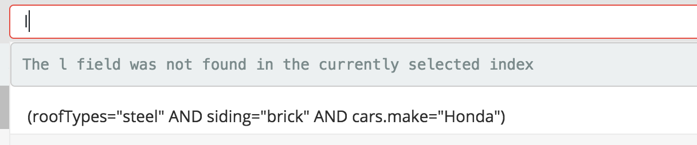
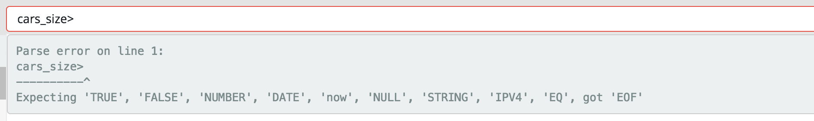
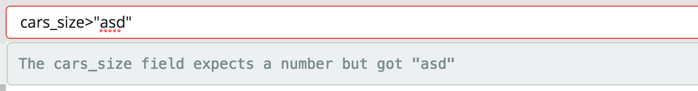

## KNQL - Query Language ## 

I will not go into details about how/what code changes were made to support this effort, instead I wish to focus on documentation and usage examples for the new query DSL.

Here is the basic BNF:

  * expressions : e \| ANY

  * booleanValue : TRUE \| FALSE

  * fieldPath : FIELD \| fieldPath DOT FIELD | fieldPath DOT ANY | FIELD ANY

  * decimal : NUMBER DOT NUMBER

  * dateTime : date TIME

  * rangeLiteral : [( simpleValue COMMA simpleValue )]

  * setValue : simpleValue \| setValue COMMA simpleValue

  * setLiteral : { setValue }

  * inClause : fieldPath IN rangeLiteral \| fieldPath IN setLiteral

  * EXISTS : EXISTS fieldPath | EXISTS e

  * simpleValue : decimal \| NUMBER \| STRING \| NULL \| booleanValue \| IPV4 \| date \| dateTime

  * operator : = \| ~= \| >= \| <= \| > \| <

  * comparison : fieldPath operator simpleValue

  * boolExpression : e AND e \| e OR e

  * unaryExpression : NOT e \| EXISTS e

  * e : booleExpression \| unaryExpression \| comparison \| fieldPath \| inClause \| isClause \| ( e )

NOTE: The ~= operator allows for wildcard queries.: field ~= "test*"

In a nutshell the above allows one to type a query that looks something like:

`````(a.b=true AND c.d IN {"a","b","c"} AND date>=2015-01-01) OR (d.e=FALSE AND NOT f.g IS NULL)`````

The * character, which represents ANY, can be used in two fundamental ways outside of a wildcard.

1. * by itself in a query with no other characters equates to a match all query.
2. Using a * in conjunction with a field name equates to a multi_match lenient query. This query allows 
the user to specify a field like a wildcard and match one value against multiple fields.

```field*="cookie"``` 

So how does the new query language solve our problem?

1. By parsing the queries in Kibana we have the ability to syntax check the query BEFORE it is converted to an Elasticsearch query.
2. The modified the Kibana code to load the nested information about an index, and pass the index information to the query parser. This allows:
  * Field validation and feedback for invalid fields
  * Type validation against the values contained in the query
  * Nested query generation support
  
More importantly, by implementing #2 above, this same nested information about a field is now stored in the Kibana index, and can be leveraged by the aggregation query generation code. 

One of the first questions that may come to mind for many of you familiar with Kibana, is 'What about existing saved queries that use the Elasticsearch query string, or custom JSON queries?' The good news is that you can still use both of those. The code that was developed detects which kind of query was placed in the query field and acts accordingly. Queries saved and reloaded also are properly detected and acted on. 

### Error Handling Examples ###

__NOTE:__ In order to avoid issues with native Kibana queries, indexPatterns that have nested support turned on can
only use the above query language.

When typing the query, the query is constantly parsed. In this example a single letter 'l' was typed which did not match any known field in the index. Please note that the existing type ahead still works.


In this example, the query is not correctly formed as it doesn't contain a value:


Finally, if the user attempts to put a value that doesn't match the type of the field, the parser will send an error.


### Nested Queries ###

In general you will never notice that nested queries are being generated, as this is done for you in the query parser. 
There are cases where a complex query requires that the nested fields be scoped correctly in order to return the correct 
results. This is where the unary EXISTS comes into play. The EXISTS provides a mechanism to scope a set of nested 
conditions together into a single condition. The thought here is that the use of EXISTS is checking for the existence 
of one or more nested objects within the parent.

Consider this query based on the simple home model defined above, where an home contains two car objects. car 
object #1 has a make of Honda, and car object #2 has a make of Acura.:

```roof="steel" AND ( cars_size=0 OR NOT car.make IN {"Lexus","Acura"})``` 

This query returns the wrong results because it was able to match one of the two nested car objects. What this query 
did was test each individual car against the "IN {"Lexus","Acura"}" rather than against the entire set of car objects. 
If the search was changed to use exists the correct result should be returned (no results in this case).

```roof="steel" AND ( cars_size=0 OR NOT EXISTS car.make IN {"Lexus","Acura"}) ```

When using EXISTS, whatever follows EXISTS as an expression, including surrounding the expression in parentheses, will 
be scoped to that one nested expression. You can use EXISTS multiple times within the same query as well.

```roof="steel" AND ( cars_size=0 OR NOT EXISTS car.make = "Lexus" OR NOT EXISTS car.make = "Acura")``` 

Please note that when saving a new style query, the next time it is loaded EXISTS unaries will be automatically injected for each scoped nested query. This happens because the query stored in the Kibana index is actually the Elasticsearch JSON query generated by the parser, and it must be reverse parsed back into the new style query language.
