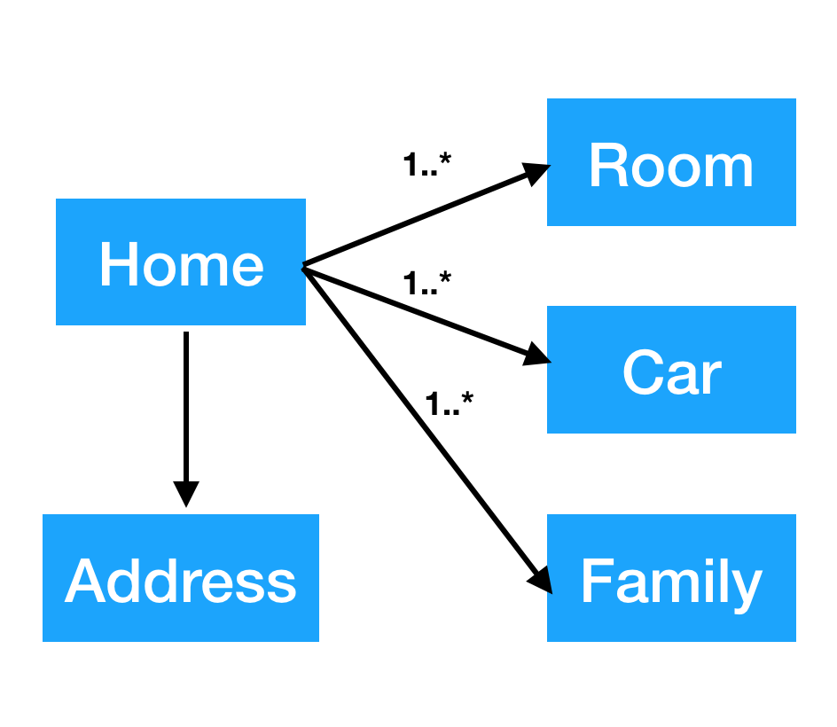
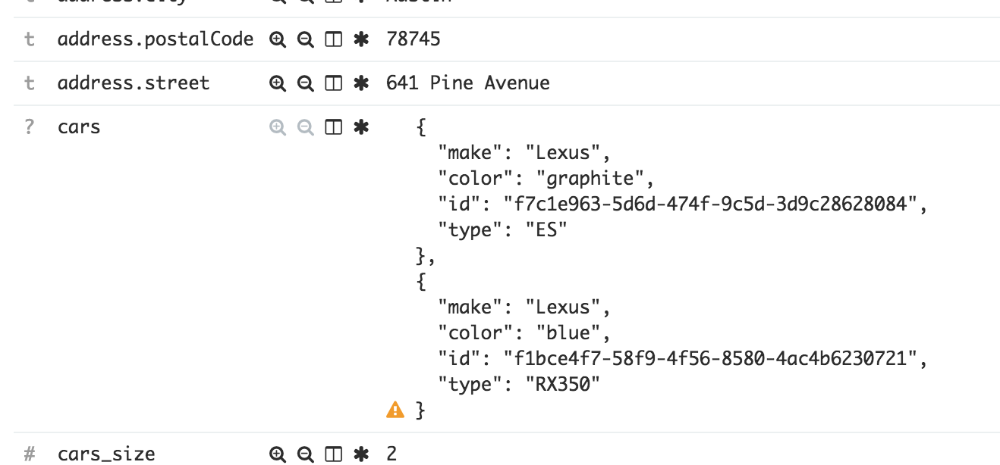
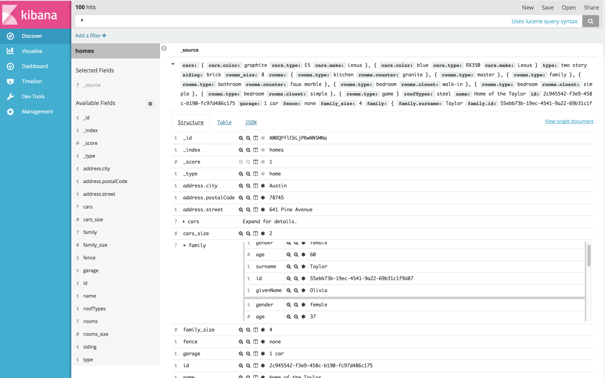

The above model illustrates a simple parent child relationship that might exist in one an indexed document. 
The home document contains an address, one or more rooms, one or more family members, and one or more cars. 
Within Elasticsearch this entity can be stored as multiple documents in a parent child relationship, or as a single 
document where the child objects are 'nested'. This plugin uses this model for testing purposes, and the mapping and 
python script used to populate Elasticsearch with test data is contained in the scripts directory of this project.

For standard Elasticsearch queries against the Elasticsearch API, querying against such an index requires some special 
handling and knowledge around what fields are actually nested in the index schema and what the nested path is to the 
child object. For additional details on nested queries please see 
[nested query documentation](https://www.elastic.co/guide/en/elasticsearch/reference/current/query-dsl-nested-query.html 
nested query documentation). 

## The Issue ##

1. Kibana doesn't parse the query entered, and instead relies on Elasticsearch to [parse the query for it](https://www.elastic.co/guide/en/elasticsearch/reference/current/query-dsl-query-string-query.html parse the query for it). This leads to several issues:
  * No feedback when a query contains a field that doesn't exist in the index and returns no results.
  * No feedback if an invalid type for a field is used (date for a boolean field) and returns no results.
  * Feedback provided for invalid query syntax returns as an exception stack trace that can be difficult to decipher.
2. Kibana doesn't know what fields are nested due to the way it loads the index mapping when an index is configured.

## Solution ##

This plugin solves the nested issue with the following changes:

1. Add a management section to enable/disable nested support for a particular indexPattern. This will add the needed 
nested path data to each nested field and flip a boolean flag on the indexPattern itself.

2. Add a new SQL like query language: Kibana Nested Query Language (KNQL) that is parsed within Kibana and outputs native elasticsearch queries. This 
language understands the fields and what fields are nested in order to properly create native queries.

3. Update the Discovery application to use the new query parser if an indexPattern has a nested flag set to true

4. Update the underlying aggregation code to honor nested configuration within an indexPattern if present.

5. **TBD** Update the discovery application to properly format and display nested data within the search results.

## Discover Application Enhancements ##

There are three major enhancements made to the discover application by this plugin: typeahead field support; field display priority;
nested field support.

### Typeahead Support for Fields ###

The existing typeahead support in Kibana has been enhanced to support showing you completions for
fields that you are typing in the query bar. These suggestions appear at the bottom of the list of
typeahead suggestions. Additionally, the typeahead area is now limited in height and will support a
scroll bar. As you use fields from the typeahead list, they will bubble up towards the top of the
list the more you use them per the existing Kibana functionality.

### Field Display Priority ###

This feature allows a Kibana administrator to configure the order and/or hide fields within the summary text
of discover results. By ordering the field display priority search results can be tailored to the
index contents in order to allow users to easily find what they might be looking for.

### Nested Field Support ###

The Discover application does not support nested objects when viewing a result's details. Instead it
displays a JSON formatted string as shown below:

In order to address this issue, a new document view has been added called 'Structured'. An example of this
view is shown below:

Arrays/Lists of nested objects are shown in a scrollable list. If an index contains nested objects,
but is not marked as nested, the structured viewer will behave as the eisting table viewer.
